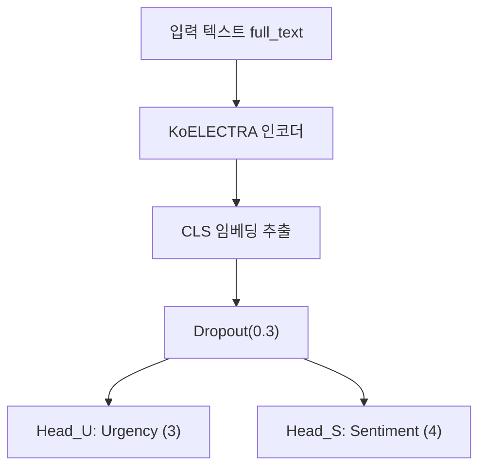

# ⚡ UrgencySense - 김원

> 본 프로젝트는 **멋쟁이사자처럼 AI 자연어처리(NLP) 단기 심화 교육 과정**에서 진행한  
> **긴급도 판단 모델 구축 프로젝트**입니다.  
> 긴급 전화를 분석하여 **통화의 긴급도(상/중/하)** 와 **감정 상태(불안, 당황, 중립 등)** 를  
> 동시에 분류하는 멀티태스크 학습 시스템을 개발했습니다.

---

## 🧩 전체 파이프라인 개요

| 단계 | 입력 | 주요 기능 | 출력 |
|------|------|------------|------|
| **EDA** | ZIP(JSON) 라벨링 데이터 | 통화 메타 정보 추출 + 대화 구조적 특징 생성 | `calls_df`, `utts_df` |
| **데이터 전처리** | EDA 결과 Feather 파일 | 텍스트 병합 + 타깃 인코딩 + Stratified Split | `MTL_ready` CSV/Parquet |
| **모델 학습** | MTL_ready 데이터셋 | KcELECTRA 멀티태스크 학습 | `best_mtl.pt` |

---

## 🔍 EDA 핵심 특징 2가지

### 1️⃣ 대화 턴 전환 횟수 (Conversation Turn Count)

신고자와 수보자 사이의 **대화가 몇 번 오갔는지**를 나타냅니다.  
이것을 **핑퐁 랠리 🏓** 에 비유할 수 있습니다.

- **긴급한 통화** → “불이야!” → “어디세요?” → “아파트요!”  
  → 빠른 턴 교환(짧은 응답, 빠른 리듬)
- **비긴급 통화** → 장황한 설명과 느린 답변 → 느린 턴 교환  

📈 **결과:** 긴급도가 높을수록 턴 전환 횟수가 증가하는 경향을 확인했습니다.  
즉, **통화가 얼마나 역동적인지**를 판단하는 유용한 지표입니다.

---

### 2️⃣ 수보자 초기 응답 시간 (Agent's Initial Response Time)

신고자가 말을 마친 후, 수보자가 첫 의미 있는 반응(질문, 지시 등)을 하기까지의 **‘침묵 시간’**을 측정합니다.  
이것은 마치 **응급실 의사의 반응 속도 🩺** 와 같습니다.

- **긴급한 상황:** 즉각적인 응답 (“숨을 못 쉬어요!” → “산소 준비해!”)  
- **덜 긴급한 상황:** 생각 후 대응 (“허리를 삐끗했어요.” → “언제부터인가요?”)

📉 **결과:** 긴급도가 높은 통화일수록 수보자의 반응 시간이 짧았습니다.  
즉, **상황 인식 속도**가 긴급도 판단의 중요한 신호로 작용했습니다.

---

## 🧮 데이터 전처리

- **발화 병합:** 동일 `recordId`의 발화를 시간순으로 정렬 → `full_text` 생성  
- **타깃 인코딩:**  
  - 긴급도: `{'하':0, '중':1, '상':2}`  
  - 감정: `{'기타부정':0, '당황/난처':1, '불안/걱정':2, '중립':3}`
- **결측값 처리:** `turn_count`, `initial_response_ms` 중앙값으로 보정  
- **Stratified Split:** (urgency, sentiment) 조합으로 8:2 분할  
- **저장 형식:** CSV + Parquet (`/Processed_Data/MTL_ready/`)

---

## 🤖 학습 방식 (KcELECTRA MTL)

멀티태스크 학습으로 **긴급도(3-class)** 와 **감정(4-class)** 를 동시에 예측합니다.

- **모델:** `beomi/KcELECTRA-base-v2022`  
- **손실 함수:** CrossEntropy (label smoothing=0.1)  
- **가중치:** α=0.4 (Urgency), β=0.6 (Sentiment)  
- **Optimizer:** AdamW + Cosine LR + Warmup  
- **Precision:** `torch.amp.autocast(bf16/fp16)`  
- **Early Stopping:** patience=3  
- **평가 지표:** Weighted F1 (per-class F1, report 포함)  

---

## 📊 결과

| Task | Weighted F1 |
|------|--------------|
| **Urgency** | **0.5817** |
| **Sentiment** | **0.6728** |

---

## 🔗 주요 노트북 링크

| 단계 | Google Colab / Drive 링크 |
|------|----------------------------|
| 📘 EDA | [Colab Link](https://colab.research.google.com/drive/1YKSupCTp0c6rzeMOqQxhX2DyhmmfPysA?usp=sharing) |
| 🧹 데이터 전처리 | [Colab Link](https://colab.research.google.com/drive/19vZ8cUREOpNvoCK_GnGDUbpgB9H0NvZQ) |
| 🧠 모델 학습 | [Colab Link](https://colab.research.google.com/drive/1XZRGRb7w8_OaWlzltY8NaJEnnXmXwK_f?usp=sharing) |
| 🧩 인퍼런스 | [Colab Link](https://colab.research.google.com/drive/1b4PzgilX-f_u2Dj9zLJ2lqvbg_Yr5kFM) |

---